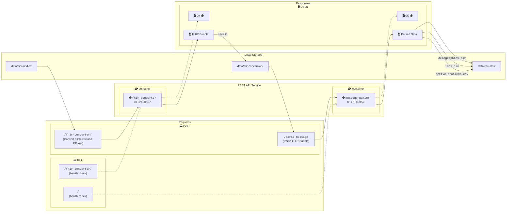

# eCR Parser

- 🖼️ <a href="#id-diagram">Architecture Diagram</a>
- ⚙️ <a href="#id-rig">Installing and managing R in `renv`</a>
- 👷 <a href="#id-renv">Installing and managing virtual environments with `renv`</a>
- 🏗️ <a href="#id-docker">Spinning up the Docker containers using the compose file</a>
- 📃 <a href="#id-scripts">Running the Quarto scripts</a>
  - Interacting with the REST APIs from the Docker compose
  - Converting the eICR and RR pairs to FHIR
  - Flatten FHIR bundles as `csv` data that can be joined on patient ID

## Architecture Diagram <a id="id-diagram">

## Installing and managing R with `rig` <a id="id-rig">

### Installation

`rig`'s instructions can be located [here](https://github.com/r-lib/rig?tab=readme-ov-file#id-installation). It is cross-platform and the instructions are clear and easy to follow.

Use `rig add` to add a new R installation:

    rig add release

Use `rig list` to list the currently installed R versions, and
`rig default` to set the default one.

Run `rig` to see all commands and examples.

Run `rig --help` and `rig <subcommand> --help` to see the documentation.

### Command list:

    rig add        -- install a new R version [alias: install]
    rig available  -- List R versions available to install.
    rig default    -- print or set default R version [alias: switch]
    rig library    -- manage package libraries [alias: lib] (experimental)
    rig list       -- list installed R versions [alias: ls]
    rig resolve    -- resolve a symbolic R version
    rig rm         -- remove R versions [aliases: del, delete, remove]
    rig rstudio    -- start RStudio with the specified R version
    rig run        -- Run R, an R script or an R project
    rig sysreqs    -- manage R-related system libraries and tools (experimental) (macOS)
    rig system     -- manage current installations

### Set up a new R version

    rig add release

You now have the release version of R ready to use and we can move on to the next section, where we'll set up the virtual environment.

## Installing and managing virtual environments with `renv` <a id="id-renv">

This project uses `renv` and the `.Rprofile`, lockfile `renv.lock`, and `renv` directory are already set up to use the virtual environment.

First make sure that you have `renv` installed:

    install.packages("renv")

To activate and install the required packages run:

    renv::restore()

This will install the required packages for this repo so that we can run the scripts in this project.

## Spinning up the Docker containers using the compose file <a id="id-docker">

You will need Docker installed on your machine or server. You can find the installation instructions [here](https://docs.docker.com/engine/install/). Once installed you will be able to run Docker compose files using `docker compose`.

Looking at the `docker-compose.yml` file you can see that we will pull the two DIBBs that we want to use, download them, and get them up and running locally.

Here are the two DIBBs:

- `fhir-converter` - This is the service that will convert our eCR data to FHIR
- `message-parser` - This is the service that will flatten our eCR data using parsing schema.

We want to make sure we're in the root directory of the repository where the `docker-compose.yaml` file is located. We'll then run:

    docker compose up -d

To make sure they're up and running, use this command:

    docker ps

You should see something like this:

    CONTAINER ID   IMAGE                                       COMMAND                  CREATED      STATUS        PORTS                                       NAMES
    a64b2379d82b   ghcr.io/cdcgov/phdi/fhir-converter:latest   "/bin/sh -c '/root/.…"   2 days ago   Up 28 hours   0.0.0.0:8082->8080/tcp, :::8082->8080/tcp   fhir-converter
    cec3b9b493f7   ghcr.io/cdcgov/phdi/message-parser:latest   "/bin/sh -c 'uvicorn…"   2 days ago   Up 28 hours   0.0.0.0:8085->8080/tcp, :::8085->8080/tcp   message-parser

## Running the Quarto scripts <a id="id-scripts">

The R scripts are run using Quarto, which is a powerful tool for running notebooks. They can also help you create reports, dashboards, books, blogs, and more.

You can install Quarto [here](https://quarto.org/docs/get-started/). It is cross-platform and has integrations in many of the IDEs that you may use, including VS Code, Jupyter, RStudio, Positron (new Posit IDE), and Neovim.

Once Quarto is installed you can run them in your IDE of choice.

### Interacting with the REST APIs from the Docker compose

This script teaches you the basics of interacting with the DIBBs APIs that are running (after starting them with Docker) using `httr2`, which is an R library for working with REST APIs.

### Converting the eICR and RR pairs to FHIR

This script will run all of the eICR and RR pairs in the `data/eicr-and-rr` directory, convert those XML to FHIR, and save them to `data/fhir-conversion`.

### Flatten FHIR bundles as `csv` data that can be joined on patient ID

This script will take the FHIR bundles in `data/fhir-conversion` and send those files to the `message-parser` to pull out data that we want flattened (happening in the parsing schema `ecr.json`), and saving those data in three `csv` files in the `data/flat-ecr` directory.

The `csv` files are set up so that you can join them on patient ID:

- `demographics.csv`
- `labs.csv`
- `active-problems.csv`

This allows disease team epidemiologists to easily work with flat data from eICR and RR files to complete their analyses and reports.
